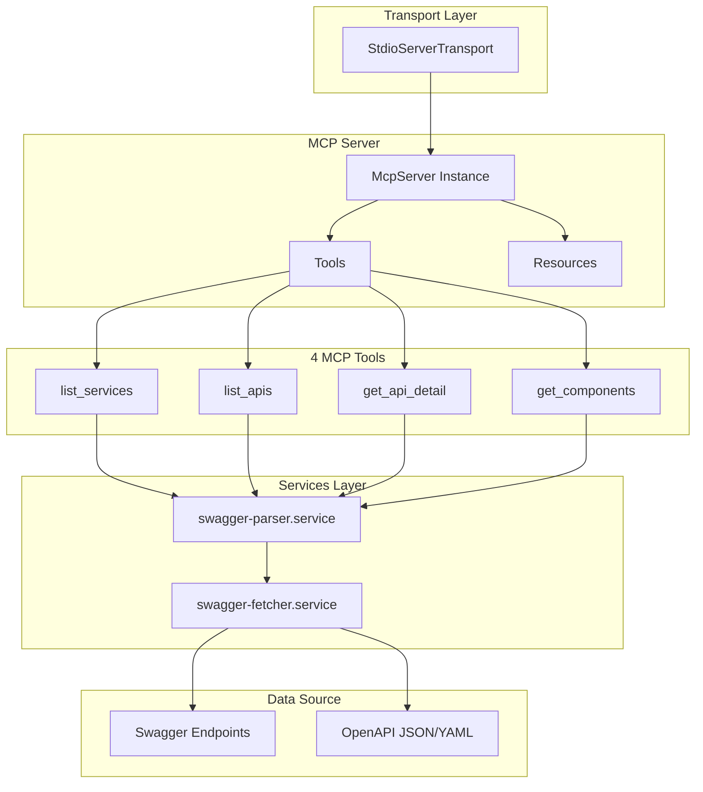
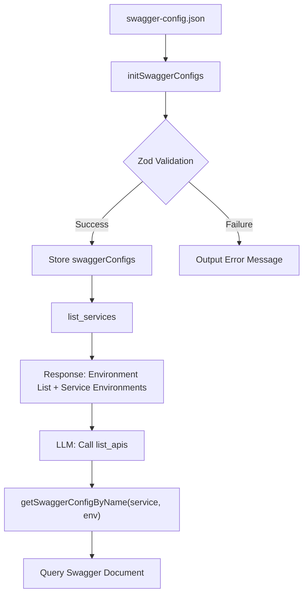

# MCP Server Project Initialization Plan

## Architecture Overview



## 1. Package Initialization and Dependency Installation

Create [package.json](package.json):

```json
{
  "name": "swagger-mcp",
  "version": "0.1.0",
  "type": "module",
  "bin": {
    "swagger-mcp": "./dist/index.mjs"
  },
  "files": ["dist"],
  "scripts": {
    "build": "tsdown",
    "dev": "tsdown --watch",
    "start": "node dist/index.mjs"
  }
}
```

**Dependencies:**
- `@modelcontextprotocol/sdk` - MCP server SDK
- `@scalar/openapi-parser` - OpenAPI document parsing
- `zod` - Schema validation (use v4: `zod/v4`)

**Dev Dependencies:**
- `typescript`
- `tsdown`
- `@types/node`

## 2. TypeScript Configuration

[tsconfig.json](tsconfig.json) - Enable strict mode:

```json
{
  "compilerOptions": {
    "target": "ES2022",
    "module": "ESNext",
    "moduleResolution": "bundler",
    "strict": true,
    "esModuleInterop": true,
    "skipLibCheck": true,
    "outDir": "./dist"
  },
  "include": ["src"]
}
```

## 3. Build Configuration

[tsdown.config.ts](tsdown.config.ts):

```typescript
import { defineConfig } from "tsdown";

export default defineConfig({
  entry: ["./src/index.ts"],
  format: ["esm"],
  clean: true,
  target: "node24",
});
```

## 4. Directory Structure

```
src/
├── index.ts                    # Entry point
├── server.ts                   # McpServer instance
├── tools/
│   ├── index.ts               # Tool registration integration
│   ├── list-services.tool.ts  # Service list query
│   ├── list-apis.tool.ts      # API list query
│   ├── get-api-detail.tool.ts # API detail query
│   └── get-components.tool.ts # Component schema query
├── resources/
│   └── swagger-docs.resource.ts
├── schemas/
│   ├── tool-inputs.schema.ts
│   └── swagger.schema.ts
├── services/
│   ├── swagger-parser.service.ts
│   └── swagger-fetcher.service.ts
└── types/
    └── swagger.types.ts
```

## 5. Core File Implementation

### 5.1 Entry Point ([src/index.ts](src/index.ts))

```typescript
import { createServer } from "./server.js";
import { StdioServerTransport } from "@modelcontextprotocol/sdk/server/stdio.js";

const server = createServer();
const transport = new StdioServerTransport();
await server.connect(transport);
```

### 5.2 Server Configuration ([src/server.ts](src/server.ts))

```typescript
import { McpServer } from "@modelcontextprotocol/sdk/server/mcp.js";
import { registerTools } from "./tools/index.js";
import { registerResources } from "./resources/swagger-docs.resource.js";

export function createServer() {
  const server = new McpServer({
    name: "swagger-mcp",
    version: "0.1.0",
  });
  
  registerTools(server);
  registerResources(server);
  
  return server;
}
```

### 5.3 Tool Skeletons

Create 4 Tool stubs:
- `list_services` - No input, returns service list
- `list_apis` - Takes serviceName input, returns API list
- `get_api_detail` - Takes serviceName/path/method input, returns detailed spec
- `get_components` - Takes serviceName/refs input, returns component schemas

## Execution Order

1. Run `pnpm init` and modify package.json
2. Install dependencies with `pnpm add`
3. Create tsconfig.json and tsdown.config.ts
4. Create src/ directory structure and skeleton files
5. Verify build with `pnpm build`

## Phase 1 TODO (Completed)

- [x] Run pnpm init and configure package.json
- [x] Install dependencies (@modelcontextprotocol/sdk, @scalar/openapi-parser, zod, typescript, tsdown)
- [x] Create tsconfig.json (strict mode)
- [x] Create tsdown.config.ts
- [x] Create src/ directory structure (tools, resources, schemas, services, types)
- [x] Create src/index.ts, src/server.ts
- [x] Create 4 Tool skeletons (list_services, list_apis, get_api_detail, get_components)
- [x] Create Zod schema files
- [x] Create service layer skeletons
- [x] Run pnpm build to verify build

---

## Phase 2: Environment-Specific Swagger Support

### Background

Currently, the MCP server queries Swagger by service name only without environment distinction. In actual development environments, different Swagger documents are used per environment (dev, stg, prod), so this needs to be supported.

### Architecture



### Changes

#### 1. Add environment field to schema

[src/schemas/swagger.schema.ts](src/schemas/swagger.schema.ts):

```typescript
export const SwaggerDocConfigSchema = z.object({
  name: z.string().describe("Service name"),
  environment: z.string().describe("Environment (e.g., dev, stg, prod)"),
  description: z.string().optional(),
  url: z.url(),
});
```

#### 2. Modify Tool input schemas

Add environment field to all Tool input schemas in [src/schemas/tool-inputs.schema.ts](src/schemas/tool-inputs.schema.ts).

#### 3. Improve list_services response

[src/services/swagger-parser.service.ts](src/services/swagger-parser.service.ts):

- Add `getAvailableEnvironments()` function
- Include available environment list per service in `listServices()` response

Response format:
```json
{
  "availableEnvironments": ["dev", "stg", "prod"],
  "services": [
    { "serviceName": "display-service", "environments": ["dev", "stg", "prod"] }
  ]
}
```

#### 4. Modify service lookup logic

[src/services/swagger-fetcher.service.ts](src/services/swagger-fetcher.service.ts):

- Change `getSwaggerConfigByName(serviceName, environment)` signature
- Error message with valid environment list when requesting non-existent environment

#### 5. Apply environment parameter to all Tools

- [src/tools/list-apis.tool.ts](src/tools/list-apis.tool.ts)
- [src/tools/get-api-detail.tool.ts](src/tools/get-api-detail.tool.ts)
- [src/tools/get-components.tool.ts](src/tools/get-components.tool.ts)

#### 6. Improve configuration file

- Create `swagger-config.example.json` sample file
- Add default path search logic (if no environment variable, search for swagger-config.json in current directory)
- Validate configuration file with Zod schema

### Usage Example

```
User: "Tell me the API list for display-service in dev environment"
LLM: Call list_apis(serviceName="display-service", environment="dev")
```

### Phase 2 TODO (Completed)

- [x] Add environment field to swagger.schema.ts
- [x] Add environment to all schemas in tool-inputs.schema.ts
- [x] Implement environment-specific lookup logic in swagger-fetcher.service.ts
- [x] Improve listServices response in swagger-parser.service.ts
- [x] Apply environment parameter to 4 Tool files
- [x] Add environment-related types to swagger.types.ts
- [x] Create swagger-config.example.json sample file
- [x] Add Zod validation and default path search logic for configuration file
