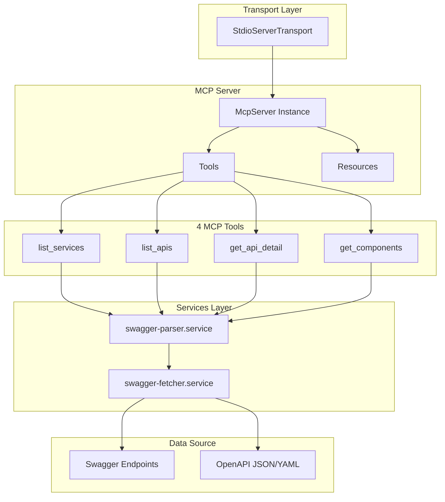

# @hynu/swagger-mcp

 [](https://smithery.ai/server/hynu/swagger-mcp)

[English](README.md) | [한국어](README.ko.md) | [中文](README.zh.md) | [日本語](README.ja.md)

Model Context Protocol (MCP) を通じて LLM に API ドキュメント（Swagger/OpenAPI）を提供するオープンソースの MCP サーバーです。開発者は自然言語を使用して API 仕様をクエリし、LLM の支援により API 統合コードを自動生成できます。

## 主な機能

プロジェクトルートの `swagger-config.json` に登録された Swagger サービスに対して、以下の機能を提供します：

- **サービス一覧クエリ**：登録されているすべての Swagger サービスの一覧を取得
- **API 一覧クエリ**：特定のサービスの API エンドポイント一覧を取得
- **API 詳細クエリ**：特定の API の parameters、requestBody、responses の詳細情報を取得
- **コンポーネントスキーマクエリ**：`$ref` で参照されているスキーマの詳細情報を取得

## 前提条件

MCP サーバーを使用する前に、以下の前提条件が必要です：

### 1. Node.js のインストール

Node.js 18 以上がインストールされている必要があります。

```bash
node -v  # v18.0.0 以上
```

> 注意：[Node.js 公式サイト](https://nodejs.org/) から LTS バージョン（20.x または 22.x）をインストールしてください。

### 2. swagger-config.json の設定

クエリする Swagger ドキュメントのリストを定義する設定ファイルを作成する必要があります。詳細な形式については、[Swagger 設定ファイルの作成](#1-swagger-設定ファイルの作成) セクションを参照してください。

### 3. MCP クライアントの設定

Cursor、Claude Desktop、Claude Code などの MCP をサポートするクライアントにサーバーを登録する必要があります。詳細な手順については、[MCP クライアントの設定](#2-mcp-クライアントの設定) セクションを参照してください。

## インストールとセットアップ

### 1. Swagger 設定ファイルの作成

`swagger-config.json` ファイルを作成して、クエリする Swagger ドキュメントを登録します。

> 重要：登録する URL は、**OpenAPI 3.0.x または 3.1.x** 仕様に準拠する JSON/YAML ドキュメントである必要があります。

```json
{
  "services": [
    {
      "name": "display-service",
      "environment": "dev",
      "description": "display service api that provides display information",
      "url": "https://dev-some-api.com/v3/api-docs/display-service"
    },
    {
      "name": "display-service",
      "environment": "prod",
      "description": "display service api that provides display information",
      "url": "https://some-api.com/v3/api-docs/display-service"
    }
  ]
}
```

| フィールド      | 必須 | 説明                     |
| --------------- | ---- | ------------------------ |
| `name`          | ✅   | サービス名                |
| `environment`   | ✅   | 環境（dev、stg、prod など）|
| `url`           | ✅   | Swagger/OpenAPI ドキュメント URL |
| `description`   | ❌   | サービスの説明            |

> **注意**：同じサービスを複数の環境（dev、stg、prod、pj）に登録できます。

### 2. MCP クライアントの設定

#### Cursor

`~/.cursor/mcp.json` またはプロジェクトの `.cursor/mcp.json` に追加：

```json
{
  "mcpServers": {
    "swagger-mcp": {
      "command": "npx",
      "args": ["-y", "@hynu/swagger-mcp@latest"],
      "env": {
        "SWAGGER_CONFIG_PATH": "/ABSOLUTE_PATH/TO/swagger-config.json"
      }
    }
  }
}
```

#### Claude Code

プロジェクトルートに `.mcp.json` ファイルを作成：

```json
{
  "mcpServers": {
    "swagger-mcp": {
      "command": "npx",
      "args": ["-y", "@hynu/swagger-mcp@latest"],
      "env": {
        "SWAGGER_CONFIG_PATH": "/ABSOLUTE_PATH/TO/swagger-config.json"
      }
    }
  }
}
```

> **重要**：`SWAGGER_CONFIG_PATH` は必ず**絶対パス**で指定する必要があります。

### 3. MCP クライアントの再起動

設定後、MCP クライアント（Cursor、IntelliJ、Claude Code など）を再起動して Swagger MCP サーバーを有効にします。

## 使用方法

### 利用可能なツール

| ツール             | 説明                         | 主要パラメータ                                  |
| ------------------ | ---------------------------- | ---------------------------------------------- |
| `list_services`    | 登録されているすべてのサービスの一覧を取得 | なし                                           |
| `list_apis`        | 特定のサービスの API 一覧を取得 | `serviceName`, `environment`, `apiGroup?`      |
| `get_api_detail`   | 特定の API の詳細仕様を取得  | `serviceName`, `environment`, `path`, `method` |
| `get_components`   | `$ref` 参照スキーマを取得    | `serviceName`, `environment`, `refs`           |

### クエリフロー（ドリルダウン方式）

LLM のトークン制限を考慮して、以下の段階的なクエリ方式を使用します：

```
1. list_services     → すべてのサービス/環境の一覧を取得
2. list_apis         → 特定のサービスの API 一覧を取得
3. get_api_detail    → 必要な API の詳細仕様を取得
4. get_components    → $ref 参照スキーマの詳細を取得
```

### 使用例

#### 1. サービス一覧のクエリ

```
ユーザー：「登録されている API サービスの一覧を教えてください」
```

LLM が `list_services` を呼び出し → サービス名、環境、API グループ情報を返す

#### 2. API 一覧のクエリ

```
ユーザー：「user-service の dev 環境の API 一覧を表示してください」
```

LLM が `list_apis` を呼び出し → そのサービスのすべての API エンドポイントの要約を返す

#### 3. API 詳細のクエリ

```
ユーザー：「POST /api/users API の詳細仕様を教えてください」
```

LLM が `get_api_detail` を呼び出し → parameters、requestBody、responses を返す

#### 4. 統合コードの生成

```
ユーザー：「user-service のユーザー検索 API を TypeScript で統合してください」
```

LLM が API 仕様をクエリした後、統合コードを自動生成

### 実際の開発シナリオ

#### シナリオ 1：新機能開発時の API 統合

```
ユーザー：「order-service の dev 環境の注文作成 API を使用して
React コンポーネントを作成してください。注文情報には商品 ID、数量、配送先情報を含める必要があります。」
```

**LLM の処理プロセス：**

1. `list_services` → order-service を確認
2. `list_apis` → 注文作成 API を検索（POST /api/orders など）
3. `get_api_detail` → リクエストスキーマを確認（商品 ID、数量、配送先フィールドを確認）
4. `get_components` → 必要なスキーマコンポーネントをクエリ（OrderRequest、Address など）
5. React コンポーネントコードを生成（API 呼び出しロジックを含む）

#### シナリオ 2：既存コードのリファクタリング

```
ユーザー：「現在ハードコードされているユーザー情報検索ロジックを
user-service の GET /api/users/{userId} API を使用するように変更してください」
```

**LLM の処理プロセス：**

1. `list_apis` → user-service のユーザー検索 API を確認
2. `get_api_detail` → レスポンススキーマを確認
3. 既存コードを分析して API 呼び出しコードに置き換え

#### シナリオ 3：エラーハンドリングの改善

```
ユーザー：「product-service の商品検索 API のレスポンススキーマを確認し、
エラーケース（404、500 など）に対する適切なエラーハンドリングを追加してください」
```

**LLM の処理プロセス：**

1. `get_api_detail` → レスポンススキーマを確認（200、404、500 など）
2. 各ステータスコードごとのエラーハンドリングロジックを追加

#### シナリオ 4：型定義の生成

```
ユーザー：「order-service の注文関連 API をクエリして
TypeScript の型定義ファイルを生成してください」
```

**LLM の処理プロセス：**

1. `list_apis` → order-service のすべての API 一覧をクエリ
2. `get_api_detail` → 各 API の requestBody、responses スキーマをクエリ
3. `get_components` → 参照されているすべてのスキーマコンポーネントをクエリ
4. TypeScript interface/type 定義ファイルを生成

#### シナリオ 5：API ドキュメントベースのテストコード作成

```
ユーザー：「user-service のユーザー作成 API 仕様を確認し、
Jest ベースの統合テストコードを作成してください」
```

**LLM の処理プロセス：**

1. `get_api_detail` → POST /api/users API の詳細仕様を確認
2. requestBody スキーマベースのテストデータを生成
3. responses スキーマベースの検証ロジックを作成
4. Jest テストコードを生成

> **ヒント**：プロンプトにサービス名、環境、API パスを明示すると、LLM がより正確に API を見つけて統合コードを生成できます。

## 開発

### 技術スタック

- **ランタイム**：Node.js 24 LTS
- **言語**：TypeScript
- **検証**：Zod v4
- **パッケージマネージャー**：pnpm
- **バンドラー**：tsdown
- **MCP SDK**：@modelcontextprotocol/sdk
- **OpenAPI パーサー**：@scalar/openapi-parser

### プロジェクト構造

```
src/
├── index.ts                    # エントリーポイント
├── server.ts                   # McpServer 設定
├── tools/                      # MCP ツール定義
│   ├── list-services.tool.ts
│   ├── list-apis.tool.ts
│   ├── get-api-detail.tool.ts
│   └── get-components.tool.ts
├── services/                   # ビジネスロジック
│   ├── swagger-fetcher.service.ts
│   └── swagger-parser.service.ts
├── schemas/                    # Zod スキーマ
│   ├── swagger.schema.ts
│   └── tool-inputs.schema.ts
└── types/                      # TypeScript 型
    └── swagger.types.ts
```

## アーキテクチャ概要



### 開発コマンド

```bash
# 依存関係のインストール
pnpm install

# 開発モード（watch）
pnpm dev

# ビルド
pnpm build

# 実行
pnpm start

# ローカルテスト（npm link 後に mcp 接続）
npm link
```

### ローカルテスト

1. `swagger-config.json` ファイルを作成
2. 環境変数を設定して実行：

```bash
SWAGGER_CONFIG_PATH=/path/to/swagger-config.json pnpm start
```

## 問題と制限事項

### OpenAPI 仕様の互換性

登録された Swagger ドキュメントが **OpenAPI 3.0.x または 3.1.x** 仕様に厳密に準拠していない場合、以下の問題が発生する可能性があります：

- **パースエラー**：仕様形式が正しくない場合、ドキュメントのパースに失敗し、サービス一覧のクエリが不可能になる場合があります。
- **情報の欠落**：必須フィールドが欠落しているか、形式が間違っている場合、API の詳細情報を正確に取得できない場合があります。
- **コンポーネント参照エラー**：`$ref` 参照が正しくないか、循環参照が存在する場合、コンポーネントスキーマのクエリに失敗する場合があります。

**推奨事項：**

- Swagger を設定する際は、OpenAPI 3.0+ 仕様に準拠した形式で提供する必要があります。

### Swagger ドキュメントへのアクセス不可

Swagger URL および OpenAPI 仕様にアクセスできない場合、API 情報を正常に取得できません。
