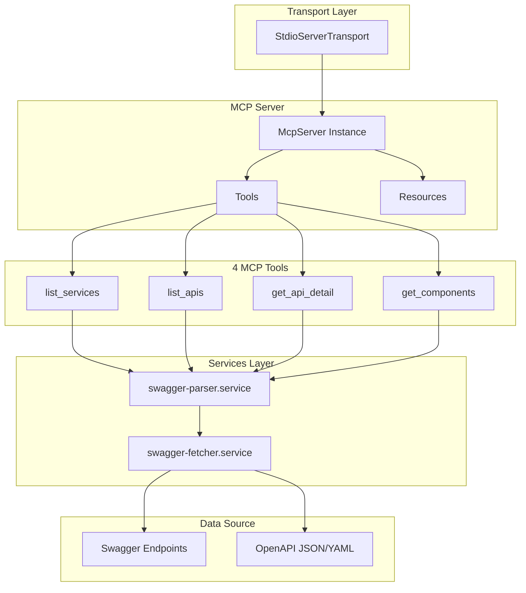

# @hynu/swagger-mcp

 [](https://smithery.ai/server/hynu/swagger-mcp)

[English](README.md) | [한국어](README.ko.md) | [中文](README.zh.md) | [日本語](README.ja.md)

LLM을 위한 Model Context Protocol (MCP)을 통해 API 문서(Swagger/OpenAPI)를 제공하는 오픈소스 MCP 서버입니다. 개발자는 자연어를 사용하여 API 스펙을 조회하고 LLM의 도움으로 API 연동 코드를 자동 생성할 수 있습니다.

## 주요 기능

프로젝트 루트의 `swagger-config.json`에 등록된 Swagger 서비스를 대상으로 다음 기능을 제공합니다:

- **서비스 목록 조회**: 등록된 전체 Swagger 서비스 목록 조회
- **API 목록 조회**: 특정 서비스의 API 엔드포인트 목록 조회
- **API 상세 조회**: 특정 API의 parameters, requestBody, responses 조회
- **컴포넌트 스키마 조회**: `$ref`로 참조된 스키마 상세 정보 조회

## 사전 요구사항

MCP 서버를 사용하기 전에 다음 사전 준비가 필요합니다:

### 1. Node.js 설치

Node.js 18 이상이 설치되어 있어야 합니다.

```bash
node -v  # v18.0.0 이상
```

> 참고: [Node.js 공식 사이트](https://nodejs.org/)에서 LTS 버전(20.x 또는 22.x)을 설치하세요.

### 2. swagger-config.json 설정

조회할 Swagger 문서 목록을 정의한 설정 파일을 생성해야 합니다. 자세한 형식은 [Swagger 설정 파일 생성](#1-swagger-설정-파일-생성) 섹션을 참고하세요.

### 3. MCP 클라이언트 설정

Cursor, Claude Desktop, Claude Code 등 MCP를 지원하는 클라이언트에 서버를 등록해야 합니다. 자세한 방법은 [MCP 클라이언트 설정](#2-mcp-클라이언트-설정) 섹션을 참고하세요.

## 설치 및 설정

### 1. Swagger 설정 파일 생성

`swagger-config.json` 파일을 생성하여 조회할 Swagger 문서들을 등록합니다.

> 중요: 등록하는 URL은 **OpenAPI 3.0.x 또는 3.1.x** 스펙을 따르는 JSON/YAML 문서여야 합니다.

```json
{
  "services": [
    {
      "name": "display-service",
      "environment": "dev",
      "description": "display service api that provides display information",
      "url": "https://dev-some-api.com/v3/api-docs/display-service"
    },
    {
      "name": "display-service",
      "environment": "prod",
      "description": "display service api that provides display information",
      "url": "https://some-api.com/v3/api-docs/display-service"
    }
  ]
}
```

| 필드          | 필수 | 설명                     |
| ------------- | ---- | ------------------------ |
| `name`        | ✅   | 서비스 이름              |
| `environment` | ✅   | 환경 (dev, stg, prod 등) |
| `url`         | ✅   | Swagger/OpenAPI 문서 URL |
| `description` | ❌   | 서비스 설명              |

> **참고**: 동일한 서비스를 여러 환경(dev, stg, prod, pj)으로 등록할 수 있습니다.

### 2. MCP 클라이언트 설정

#### Cursor

`~/.cursor/mcp.json` 또는 프로젝트의 `.cursor/mcp.json`에 추가:

```json
{
  "mcpServers": {
    "swagger-mcp": {
      "command": "npx",
      "args": ["-y", "@hynu/swagger-mcp@latest"],
      "env": {
        "SWAGGER_CONFIG_PATH": "/ABSOLUTE_PATH/TO/swagger-config.json"
      }
    }
  }
}
```

#### Claude Code

프로젝트 루트에 `.mcp.json` 파일을 생성하여 설정합니다:

```json
{
  "mcpServers": {
    "swagger-mcp": {
      "command": "npx",
      "args": ["-y", "@hynu/swagger-mcp@latest"],
      "env": {
        "SWAGGER_CONFIG_PATH": "/ABSOLUTE_PATH/TO/swagger-config.json"
      }
    }
  }
}
```

> **중요**: `SWAGGER_CONFIG_PATH`는 반드시 **절대 경로**로 지정해야 합니다.

### 3. MCP 클라이언트 재시작

설정 후 MCP 클라이언트(Cursor, IntelliJ, Claude Code 등)를 재시작하면 Swagger MCP 서버가 활성화됩니다.

## 사용 방법

### 제공되는 Tools

| Tool             | 설명                         | 주요 파라미터                                  |
| ---------------- | ---------------------------- | ---------------------------------------------- |
| `list_services`  | 등록된 전체 서비스 목록 조회 | 없음                                           |
| `list_apis`      | 특정 서비스의 API 목록 조회  | `serviceName`, `environment`, `apiGroup?`      |
| `get_api_detail` | 특정 API의 상세 스펙 조회    | `serviceName`, `environment`, `path`, `method` |
| `get_components` | `$ref` 참조 스키마 조회      | `serviceName`, `environment`, `refs`           |

### 조회 흐름 (Drill-down 방식)

LLM의 토큰 제한을 고려하여, 다음과 같은 단계적 조회 방식을 사용합니다:

```
1. list_services     → 전체 서비스/환경 목록 획득
2. list_apis         → 특정 서비스의 API 목록 획득
3. get_api_detail    → 필요한 API의 상세 스펙 획득
4. get_components    → $ref 참조 스키마 상세 획득
```

### 사용 예시

#### 1. 서비스 목록 조회

```
사용자: "등록된 API 서비스 목록을 알려줘"
```

LLM이 `list_services` 호출 → 서비스명, 환경, API 그룹 정보 반환

#### 2. API 목록 조회

```
사용자: "user-service의 dev 환경 API 목록을 보여줘"
```

LLM이 `list_apis` 호출 → 해당 서비스의 모든 API 엔드포인트 요약 반환

#### 3. API 상세 조회

```
사용자: "POST /api/users API 상세 스펙을 알려줘"
```

LLM이 `get_api_detail` 호출 → parameters, requestBody, responses 반환

#### 4. 연동 코드 생성

```
사용자: "user-service의 사용자 조회 API를 TypeScript로 연동해줘"
```

LLM이 API 스펙을 조회한 후, 연동 코드 자동 생성

### 실제 개발 시나리오 예시

#### 시나리오 1: 신규 기능 개발 시 API 연동

```
사용자: "order-service의 dev 환경에서 주문 생성 API를 사용해서
React 컴포넌트를 만들어줘. 주문 정보는 상품 ID, 수량, 배송지 정보를 포함해야 해."
```

**LLM 동작 과정:**

1. `list_services` → order-service 확인
2. `list_apis` → 주문 생성 API 찾기 (POST /api/orders 등)
3. `get_api_detail` → 요청 스키마 확인 (상품 ID, 수량, 배송지 필드 확인)
4. `get_components` → 필요한 스키마 컴포넌트 조회 (OrderRequest, Address 등)
5. React 컴포넌트 코드 생성 (API 호출 로직 포함)

#### 시나리오 2: 기존 코드 리팩토링

```
사용자: "현재 하드코딩된 사용자 정보 조회 로직을 user-service의
GET /api/users/{userId} API를 사용하도록 변경해줘"
```

**LLM 동작 과정:**

1. `list_apis` → user-service의 사용자 조회 API 확인
2. `get_api_detail` → 응답 스키마 확인
3. 기존 코드 분석 후 API 호출 코드로 교체

#### 시나리오 3: 에러 처리 개선

```
사용자: "product-service의 상품 조회 API 응답 스키마를 확인하고,
에러 케이스(404, 500 등)에 대한 적절한 에러 핸들링을 추가해줘"
```

**LLM 동작 과정:**

1. `get_api_detail` → responses 스키마 확인 (200, 404, 500 등)
2. 각 상태 코드별 에러 처리 로직 추가

#### 시나리오 4: 타입 정의 생성

```
사용자: "order-service의 주문 관련 API들을 조회해서
TypeScript 타입 정의 파일을 생성해줘"
```

**LLM 동작 과정:**

1. `list_apis` → order-service의 모든 API 목록 조회
2. `get_api_detail` → 각 API의 requestBody, responses 스키마 조회
3. `get_components` → 참조된 모든 스키마 컴포넌트 조회
4. TypeScript interface/type 정의 파일 생성

#### 시나리오 5: API 문서 기반 테스트 코드 작성

```
사용자: "user-service의 사용자 생성 API 스펙을 보고
Jest 기반의 통합 테스트 코드를 작성해줘"
```

**LLM 동작 과정:**

1. `get_api_detail` → POST /api/users API 상세 스펙 확인
2. requestBody 스키마 기반 테스트 데이터 생성
3. responses 스키마 기반 검증 로직 작성
4. Jest 테스트 코드 생성

> **팁**: 프롬프트에 서비스명, 환경, API 경로를 명시하면 LLM이 더 정확하게 API를 찾아 연동 코드를 생성할 수 있습니다.

## 개발

### 기술 스택

- **Runtime**: Node.js 24 LTS
- **Language**: TypeScript
- **Validation**: Zod v4
- **Package Manager**: pnpm
- **Bundler**: tsdown
- **MCP SDK**: @modelcontextprotocol/sdk
- **OpenAPI Parser**: @scalar/openapi-parser

### 프로젝트 구조

```
src/
├── index.ts                    # Entry point
├── server.ts                   # McpServer 설정
├── tools/                      # MCP Tool 정의
│   ├── list-services.tool.ts
│   ├── list-apis.tool.ts
│   ├── get-api-detail.tool.ts
│   └── get-components.tool.ts
├── services/                   # 비즈니스 로직
│   ├── swagger-fetcher.service.ts
│   └── swagger-parser.service.ts
├── schemas/                    # Zod 스키마
│   ├── swagger.schema.ts
│   └── tool-inputs.schema.ts
└── types/                      # TypeScript 타입
    └── swagger.types.ts
```

## 아키텍처 개요



### 개발 명령어

```bash
# 의존성 설치
pnpm install

# 개발 모드 (watch)
pnpm dev

# 빌드
pnpm build

# 실행
pnpm start

# 로컬 테스트 (npm link 후 mcp 연결)
npm link
```

### 로컬 테스트

1. `swagger-config.json` 파일 생성
2. 환경변수 설정 후 실행:

```bash
SWAGGER_CONFIG_PATH=/path/to/swagger-config.json pnpm start
```

## 이슈 및 제한사항

### OpenAPI 스펙 호환성

등록된 Swagger 문서가 **OpenAPI 3.0.x 또는 3.1.x** 스펙을 정확히 따르지 않는 경우, 다음과 같은 문제가 발생할 수 있습니다:

- **파싱 에러**: 스펙 형식이 올바르지 않으면 문서 파싱에 실패하여 서비스 목록 조회가 불가능할 수 있습니다.
- **정보 누락**: 스펙의 필수 필드가 누락되거나 형식이 잘못된 경우, API 상세 정보를 정확히 가져오지 못할 수 있습니다.
- **컴포넌트 참조 오류**: `$ref` 참조가 올바르지 않거나 순환 참조가 있는 경우, 컴포넌트 스키마 조회에 실패할 수 있습니다.

**권장 사항:**

- Swagger 설정 시 OpenAPI 3.0+ 스펙에 맞는 형태로 제공이 필요합니다.

### Swagger 문서 접근 불가

Swagger URL 및 OpenAPI 스펙에 접근하지 못하는 경우 정상적으로 API 정보를 가져올 수 없습니다.
