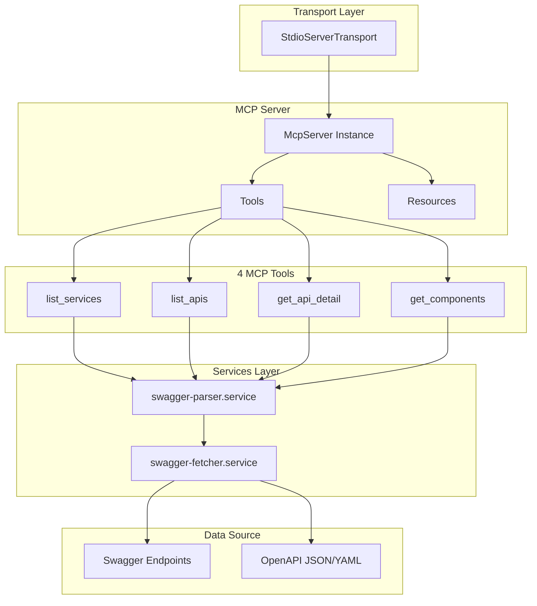

# @hynu/swagger-mcp


[English](README.md) | [한국어](README.ko.md) | [中文](README.zh.md) | [日本語](README.ja.md)

An open-source MCP server that provides API documentation (Swagger/OpenAPI) to LLMs through the Model Context Protocol (MCP). Developers can query API specifications using natural language and automatically generate API integration code with LLM assistance.

## Key Features

Provides the following features for Swagger services registered in the project root `swagger-config.json`:

- **Service List Query**: Retrieve a list of all registered Swagger services
- **API List Query**: Retrieve API endpoint lists for specific services
- **API Detail Query**: Retrieve detailed information including parameters, requestBody, and responses for specific APIs
- **Component Schema Query**: Retrieve detailed schema information referenced by `$ref`

## Prerequisites

Before using the MCP server, the following prerequisites are required:

### 1. Node.js Installation

Node.js 18 or higher must be installed.

```bash
node -v  # v18.0.0 or higher
```

> Note: Install the LTS version (20.x or 22.x) from the [official Node.js website](https://nodejs.org/).

### 2. swagger-config.json Configuration

You need to create a configuration file that defines the list of Swagger documents to query. For detailed format information, refer to the [Creating Swagger Configuration File](#1-creating-swagger-configuration-file) section.

### 3. MCP Client Configuration

You need to register the server with MCP-supported clients such as Cursor, Claude Desktop, Claude Code, etc. For detailed instructions, refer to the [MCP Client Configuration](#2-mcp-client-configuration) section.

## Installation and Setup

### 1. Creating Swagger Configuration File

Create a `swagger-config.json` file to register the Swagger documents you want to query.

> Important: The registered URLs must be JSON/YAML documents that follow the **OpenAPI 3.0.x or 3.1.x** specification.

```json
{
  "services": [
    {
      "name": "display-service",
      "environment": "dev",
      "description": "display service api that provides display information",
      "url": "https://dev-some-api.com/v3/api-docs/display-service"
    },
    {
      "name": "display-service",
      "environment": "prod",
      "description": "display service api that provides display information",
      "url": "https://some-api.com/v3/api-docs/display-service"
    }
  ]
}
```

| Field         | Required | Description                           |
| ------------- | -------- | ------------------------------------- |
| `name`        | ✅       | Service name                          |
| `environment` | ✅       | Environment (dev, stg, prod, etc.)    |
| `url`         | ✅       | Swagger/OpenAPI document URL          |
| `description` | ❌       | Service description                   |

> **Note**: You can register the same service across multiple environments (dev, stg, prod, pj).

### 2. MCP Client Configuration

#### Cursor

Create a `.cursor/mcp.json` file in your project root:

```json
{
  "mcpServers": {
    "swagger-mcp": {
      "command": "npx",
      "args": ["-y", "@hynu/swagger-mcp@latest"],
      "env": {
        "SWAGGER_CONFIG_PATH": "/ABSOLUTE_PATH/TO/swagger-config.json"
      }
    }
  }
}
```

#### Claude Code

Create a `.mcp.json` file in your project root:

```json
{
  "mcpServers": {
    "swagger-mcp": {
      "command": "npx",
      "args": ["-y", "@hynu/swagger-mcp@latest"],
      "env": {
        "SWAGGER_CONFIG_PATH": "/ABSOLUTE_PATH/TO/swagger-config.json"
      }
    }
  }
}
```

> **Important**: `SWAGGER_CONFIG_PATH` must be specified as an **absolute path**.

### 3. Restart MCP Client

After configuration, restart your MCP client (Cursor, IntelliJ, Claude Code, etc.) to activate the Swagger MCP server.

## Usage

### Available Tools

| Tool             | Description                                    | Key Parameters                                  |
| ---------------- | ---------------------------------------------- | ---------------------------------------------- |
| `list_services`  | Retrieve a list of all registered services     | None                                           |
| `list_apis`      | Retrieve API list for a specific service       | `serviceName`, `environment`, `apiGroup?`      |
| `get_api_detail` | Retrieve detailed spec for a specific API      | `serviceName`, `environment`, `path`, `method` |
| `get_components` | Retrieve schema referenced by `$ref`           | `serviceName`, `environment`, `refs`           |

### Query Flow (Drill-down Approach)

Considering LLM token limitations, we use a step-by-step query approach:

```
1. list_services     → Obtain all service/environment list
2. list_apis         → Obtain API list for specific service
3. get_api_detail    → Obtain detailed spec for required API
4. get_components    → Obtain detailed $ref referenced schema
```

### Usage Examples

#### 1. Service List Query

```
User: "Show me the list of registered API services"
```

LLM calls `list_services` → Returns service name, environment, API group information

#### 2. API List Query

```
User: "Show me the API list for user-service in dev environment"
```

LLM calls `list_apis` → Returns summary of all API endpoints for that service

#### 3. API Detail Query

```
User: "Show me the detailed spec for POST /api/users API"
```

LLM calls `get_api_detail` → Returns parameters, requestBody, responses

#### 4. Integration Code Generation

```
User: "Integrate the user query API from user-service using TypeScript"
```

LLM queries API spec and automatically generates integration code

### Real-World Development Scenarios

#### Scenario 1: API Integration for New Feature Development

```
User: "Create a React component using the order creation API from order-service
in dev environment. Order information should include product ID, quantity, and shipping address."
```

**LLM Process:**

1. `list_services` → Verify order-service
2. `list_apis` → Find order creation API (POST /api/orders, etc.)
3. `get_api_detail` → Verify request schema (check product ID, quantity, shipping address fields)
4. `get_components` → Query required schema components (OrderRequest, Address, etc.)
5. Generate React component code (including API call logic)

#### Scenario 2: Refactoring Existing Code

```
User: "Change the hardcoded user information query logic to use
GET /api/users/{userId} API from user-service"
```

**LLM Process:**

1. `list_apis` → Verify user query API from user-service
2. `get_api_detail` → Verify response schema
3. Analyze existing code and replace with API call code

#### Scenario 3: Error Handling Improvement

```
User: "Check the product query API response schema from product-service
and add appropriate error handling for error cases (404, 500, etc.)"
```

**LLM Process:**

1. `get_api_detail` → Verify responses schema (200, 404, 500, etc.)
2. Add error handling logic for each status code

#### Scenario 4: Type Definition Generation

```
User: "Query order-related APIs from order-service and
generate a TypeScript type definition file"
```

**LLM Process:**

1. `list_apis` → Query all API list from order-service
2. `get_api_detail` → Query requestBody and responses schema for each API
3. `get_components` → Query all referenced schema components
4. Generate TypeScript interface/type definition file

#### Scenario 5: Test Code Writing Based on API Documentation

```
User: "Check the user creation API spec from user-service and
write Jest-based integration test code"
```

**LLM Process:**

1. `get_api_detail` → Verify POST /api/users API detailed spec
2. Generate test data based on requestBody schema
3. Write validation logic based on responses schema
4. Generate Jest test code

> **Tip**: Explicitly specifying service name, environment, and API path in prompts helps LLMs find APIs more accurately and generate integration code.

## Development

### Tech Stack

- **Runtime**: Node.js 24 LTS
- **Language**: TypeScript
- **Validation**: Zod v4
- **Package Manager**: pnpm
- **Bundler**: tsdown
- **MCP SDK**: @modelcontextprotocol/sdk
- **OpenAPI Parser**: @scalar/openapi-parser

### Project Structure

```
src/
├── index.ts                    # Entry point
├── server.ts                   # McpServer configuration
├── tools/                      # MCP Tool definitions
│   ├── list-services.tool.ts
│   ├── list-apis.tool.ts
│   ├── get-api-detail.tool.ts
│   └── get-components.tool.ts
├── services/                   # Business logic
│   ├── swagger-fetcher.service.ts
│   └── swagger-parser.service.ts
├── schemas/                    # Zod schemas
│   ├── swagger.schema.ts
│   └── tool-inputs.schema.ts
└── types/                      # TypeScript types
    └── swagger.types.ts
```

## Architecture Overview



### Development Commands

```bash
# Install dependencies
pnpm install

# Development mode (watch)
pnpm dev

# Build
pnpm build

# Run
pnpm start

# Local testing (after npm link, connect mcp)
npm link
```

### Local Testing

1. Create `swagger-config.json` file
2. Set environment variable and run:

```bash
SWAGGER_CONFIG_PATH=/path/to/swagger-config.json pnpm start
```

## Issues and Limitations

### OpenAPI Specification Compatibility

If registered Swagger documents do not strictly follow the **OpenAPI 3.0.x or 3.1.x** specification, the following issues may occur:

- **Parsing Error**: If the spec format is incorrect, document parsing may fail, making it impossible to query the service list.
- **Missing Information**: If required fields are missing or the format is incorrect, API detail information may not be retrieved accurately.
- **Component Reference Error**: If `$ref` references are incorrect or circular references exist, component schema queries may fail.

**Recommendations:**

- When configuring Swagger, ensure it follows the OpenAPI 3.0+ specification format.

### Swagger Document Access Issues

If Swagger URLs and OpenAPI specs are inaccessible, API information cannot be retrieved normally.
