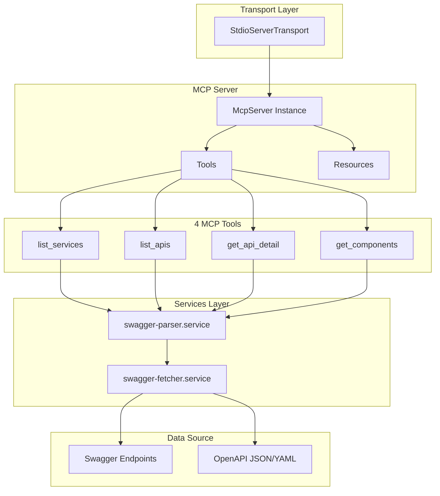

# @hynu/swagger-mcp


[English](README.md) | [한국어](README.ko.md) | [中文](README.zh.md) | [日本語](README.ja.md)

一个通过模型上下文协议（MCP）向 LLM 提供 API 文档（Swagger/OpenAPI）的开源 MCP 服务器。开发者可以使用自然语言查询 API 规范，并在 LLM 的帮助下自动生成 API 集成代码。

## 主要功能

为在项目根目录 `swagger-config.json` 中注册的 Swagger 服务提供以下功能：

- **服务列表查询**：检索所有已注册的 Swagger 服务列表
- **API 列表查询**：检索特定服务的 API 端点列表
- **API 详情查询**：检索特定 API 的 parameters、requestBody 和 responses 详细信息
- **组件模式查询**：检索由 `$ref` 引用的模式详细信息

## 前置要求

在使用 MCP 服务器之前，需要满足以下前置要求：

### 1. Node.js 安装

必须安装 Node.js 18 或更高版本。

```bash
node -v  # v18.0.0 或更高版本
```

> 注意：请从 [Node.js 官方网站](https://nodejs.org/) 安装 LTS 版本（20.x 或 22.x）。

### 2. swagger-config.json 配置

您需要创建一个配置文件，定义要查询的 Swagger 文档列表。有关详细格式信息，请参阅 [创建 Swagger 配置文件](#1-创建-swagger-配置文件) 部分。

### 3. MCP 客户端配置

您需要在支持 MCP 的客户端（如 Cursor、Claude Desktop、Claude Code 等）中注册服务器。有关详细说明，请参阅 [MCP 客户端配置](#2-mcp-客户端配置) 部分。

## 安装和设置

### 1. 创建 Swagger 配置文件

创建 `swagger-config.json` 文件以注册要查询的 Swagger 文档。

> 重要：注册的 URL 必须是遵循 **OpenAPI 3.0.x 或 3.1.x** 规范的 JSON/YAML 文档。

```json
{
  "services": [
    {
      "name": "display-service",
      "environment": "dev",
      "description": "display service api that provides display information",
      "url": "https://dev-some-api.com/v3/api-docs/display-service"
    },
    {
      "name": "display-service",
      "environment": "prod",
      "description": "display service api that provides display information",
      "url": "https://some-api.com/v3/api-docs/display-service"
    }
  ]
}
```

| 字段          | 必需 | 说明                     |
| ------------- | ---- | ------------------------ |
| `name`        | ✅   | 服务名称                 |
| `environment` | ✅   | 环境（dev、stg、prod 等）|
| `url`         | ✅   | Swagger/OpenAPI 文档 URL |
| `description` | ❌   | 服务描述                 |

> **注意**：您可以在多个环境（dev、stg、prod、pj）中注册同一服务。

### 2. MCP 客户端配置

#### Cursor

在项目根目录创建 `.cursor/mcp.json` 文件：

```json
{
  "mcpServers": {
    "swagger-mcp": {
      "command": "npx",
      "args": ["-y", "@hynu/swagger-mcp@latest"],
      "env": {
        "SWAGGER_CONFIG_PATH": "/ABSOLUTE_PATH/TO/swagger-config.json"
      }
    }
  }
}
```

#### Claude Code

在项目根目录创建 `.mcp.json` 文件：

```json
{
  "mcpServers": {
    "swagger-mcp": {
      "command": "npx",
      "args": ["-y", "@hynu/swagger-mcp@latest"],
      "env": {
        "SWAGGER_CONFIG_PATH": "/ABSOLUTE_PATH/TO/swagger-config.json"
      }
    }
  }
}
```

> **重要**：`SWAGGER_CONFIG_PATH` 必须指定为**绝对路径**。

### 3. 重启 MCP 客户端

配置后，重启您的 MCP 客户端（Cursor、IntelliJ、Claude Code 等）以激活 Swagger MCP 服务器。

## 使用方法

### 可用工具

| 工具             | 说明                         | 主要参数                                  |
| ---------------- | ---------------------------- | ----------------------------------------- |
| `list_services`  | 检索所有已注册服务的列表     | 无                                        |
| `list_apis`      | 检索特定服务的 API 列表      | `serviceName`, `environment`, `apiGroup?` |
| `get_api_detail` | 检索特定 API 的详细规范      | `serviceName`, `environment`, `path`, `method` |
| `get_components` | 检索由 `$ref` 引用的模式     | `serviceName`, `environment`, `refs`       |

### 查询流程（向下钻取方式）

考虑到 LLM 的令牌限制，我们使用分步查询方式：

```
1. list_services     → 获取所有服务/环境列表
2. list_apis         → 获取特定服务的 API 列表
3. get_api_detail    → 获取所需 API 的详细规范
4. get_components    → 获取详细的 $ref 引用模式
```

### 使用示例

#### 1. 服务列表查询

```
用户："显示已注册的 API 服务列表"
```

LLM 调用 `list_services` → 返回服务名称、环境、API 组信息

#### 2. API 列表查询

```
用户："显示 user-service 在 dev 环境中的 API 列表"
```

LLM 调用 `list_apis` → 返回该服务的所有 API 端点摘要

#### 3. API 详情查询

```
用户："显示 POST /api/users API 的详细规范"
```

LLM 调用 `get_api_detail` → 返回 parameters、requestBody、responses

#### 4. 集成代码生成

```
用户："使用 TypeScript 集成 user-service 的用户查询 API"
```

LLM 查询 API 规范后自动生成集成代码

### 实际开发场景

#### 场景 1：新功能开发时的 API 集成

```
用户："使用 order-service 在 dev 环境中的订单创建 API
创建一个 React 组件。订单信息应包含产品 ID、数量和配送地址。"
```

**LLM 处理过程：**

1. `list_services` → 验证 order-service
2. `list_apis` → 查找订单创建 API（POST /api/orders 等）
3. `get_api_detail` → 验证请求模式（检查产品 ID、数量、配送地址字段）
4. `get_components` → 查询所需的模式组件（OrderRequest、Address 等）
5. 生成 React 组件代码（包括 API 调用逻辑）

#### 场景 2：重构现有代码

```
用户："将硬编码的用户信息查询逻辑更改为使用
user-service 的 GET /api/users/{userId} API"
```

**LLM 处理过程：**

1. `list_apis` → 验证 user-service 的用户查询 API
2. `get_api_detail` → 验证响应模式
3. 分析现有代码并用 API 调用代码替换

#### 场景 3：错误处理改进

```
用户："检查 product-service 的产品查询 API 响应模式
并为错误情况（404、500 等）添加适当的错误处理"
```

**LLM 处理过程：**

1. `get_api_detail` → 验证响应模式（200、404、500 等）
2. 为每个状态代码添加错误处理逻辑

#### 场景 4：类型定义生成

```
用户："查询 order-service 的订单相关 API
并生成 TypeScript 类型定义文件"
```

**LLM 处理过程：**

1. `list_apis` → 查询 order-service 的所有 API 列表
2. `get_api_detail` → 查询每个 API 的 requestBody 和 responses 模式
3. `get_components` → 查询所有引用的模式组件
4. 生成 TypeScript interface/type 定义文件

#### 场景 5：基于 API 文档编写测试代码

```
用户："查看 user-service 的用户创建 API 规范
并编写基于 Jest 的集成测试代码"
```

**LLM 处理过程：**

1. `get_api_detail` → 验证 POST /api/users API 详细规范
2. 基于 requestBody 模式生成测试数据
3. 基于 responses 模式编写验证逻辑
4. 生成 Jest 测试代码

> **提示**：在提示中明确指定服务名称、环境和 API 路径有助于 LLM 更准确地查找 API 并生成集成代码。

## 开发

### 技术栈

- **运行时**：Node.js 24 LTS
- **语言**：TypeScript
- **验证**：Zod v4
- **包管理器**：pnpm
- **打包工具**：tsdown
- **MCP SDK**：@modelcontextprotocol/sdk
- **OpenAPI 解析器**：@scalar/openapi-parser

### 项目结构

```
src/
├── index.ts                    # 入口点
├── server.ts                   # McpServer 配置
├── tools/                      # MCP 工具定义
│   ├── list-services.tool.ts
│   ├── list-apis.tool.ts
│   ├── get-api-detail.tool.ts
│   └── get-components.tool.ts
├── services/                   # 业务逻辑
│   ├── swagger-fetcher.service.ts
│   └── swagger-parser.service.ts
├── schemas/                    # Zod 模式
│   ├── swagger.schema.ts
│   └── tool-inputs.schema.ts
└── types/                      # TypeScript 类型
    └── swagger.types.ts
```

## 架构概览



### 开发命令

```bash
# 安装依赖
pnpm install

# 开发模式（watch）
pnpm dev

# 构建
pnpm build

# 运行
pnpm start

# 本地测试（npm link 后连接 mcp）
npm link
```

### 本地测试

1. 创建 `swagger-config.json` 文件
2. 设置环境变量后运行：

```bash
SWAGGER_CONFIG_PATH=/path/to/swagger-config.json pnpm start
```

## 问题和限制

### OpenAPI 规范兼容性

如果注册的 Swagger 文档未严格遵循 **OpenAPI 3.0.x 或 3.1.x** 规范，可能会出现以下问题：

- **解析错误**：如果规范格式不正确，文档解析可能失败，无法查询服务列表。
- **信息缺失**：如果缺少必需字段或格式不正确，可能无法准确检索 API 详细信息。
- **组件引用错误**：如果 `$ref` 引用不正确或存在循环引用，组件模式查询可能失败。

**建议：**

- 配置 Swagger 时，请确保其遵循 OpenAPI 3.0+ 规范格式。

### Swagger 文档访问问题

如果无法访问 Swagger URL 和 OpenAPI 规范，则无法正常检索 API 信息。
